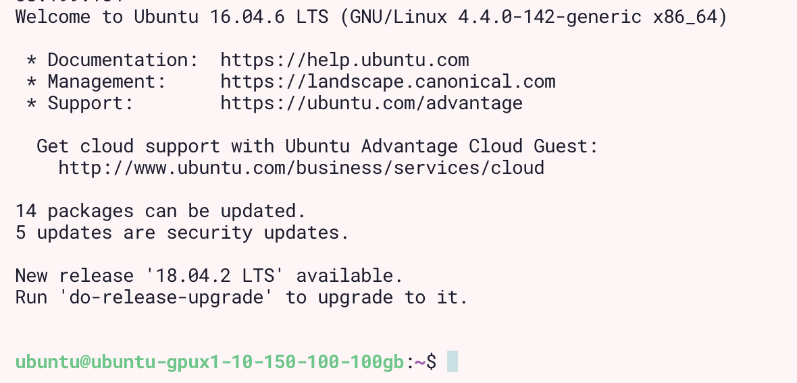
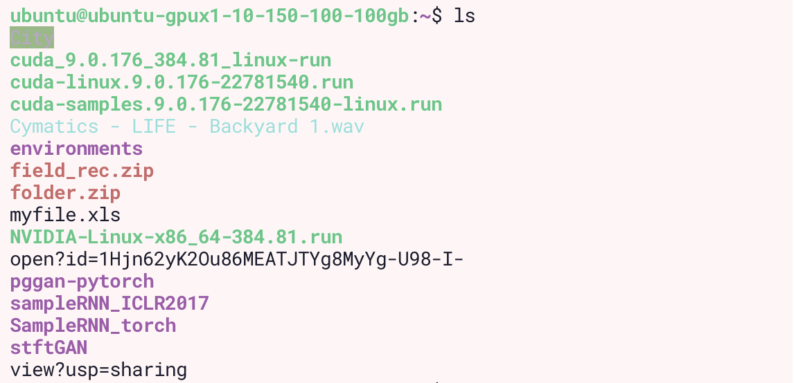
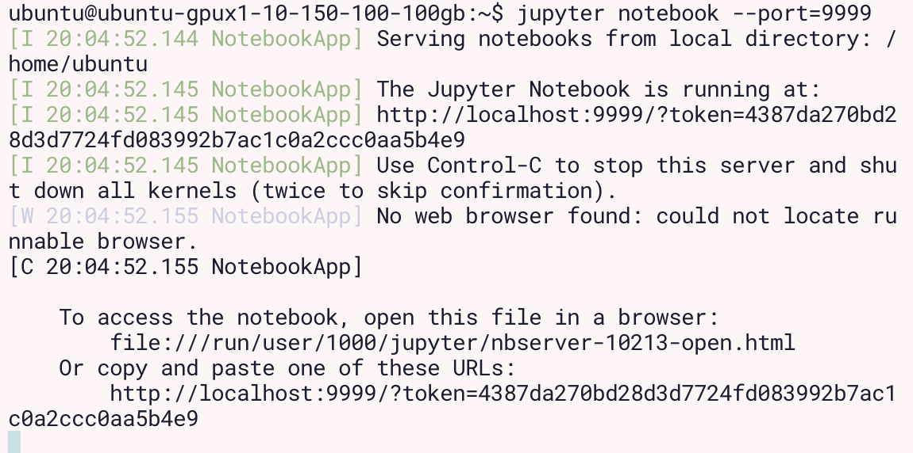

## Connection to the server:
1. Get the key from

2. Open terminals and run commands:

`chmod 400 <path to the key>`, replace `<path to the key>` for real path to key file, example:

+ ``` chmod 400 ~/keys/CentOS_GPUx1-10-150-100_100GB_id_rsa.pem ```

`ssh -i <path to the key> ubuntu@85.192.35.42`, replace `<path to the key>` for real path to key file, example:

+ `ssh -i  ~/keys/CentOS_GPUx1-10-150-100_100GB_id_rsa.pem ubuntu@85.192.35.42`     


3. Once you on the machine, the left side of the terminal should look like this:



4. Run list command
`ls`. You will see the following output



5. Choose folder with the desired model and run _change directory_ command: `cd <name of the folder>`, example `cd pggan-pytorch/`.
6.
    + If you want to create new training run `tmux new-session -s <name of session>`, please name the sessions using you name, surname or other sort of identification, example `tmux new-session -s gan_images_natasha`. Then run `jupyter nootebok --port=<port>`, replace _port_ with 4 numbers, example `jupyter nootebok --port=8888`. Some ports can be occupied, change number, util successfully getting following window

    

    + The list of running sessions can be seen using command `tmux ls`
    + if you want to check on the progress on your training connect to running session from the list, using correct names, example `tmux a -t gan_images_natasha`

7. Open another tab/window of your terminal. Run `ssh -N -f -L localhost:<port>:localhost:<port> -i <path to the key> ubuntu@85.192.35.42`, filled out _path to key_ and _port_ with your path and port, example `ssh -N -f -L localhost:8888:localhost:8888 -i ~/keys/CentOS_GPUx1-10-150-100_100GB_id_rsa.pem ubuntu@85.192.35.42`

8. Connect to the server again. Use step 2.
9. Run `jupyter notebook list`
10. From the list choose item with your port in `localhost:8888`, paste the address into your browser, like that [http://localhost:8899/?token=cfb16c59053478f4673c2b53772cdad33228c64ade74b8d5](http://localhost:8899/?token=cfb16c59053478f4673c2b53772cdad33228c64ade74b8d5)

11. Open the notebook there. The example of how it may look like can be found here [GAN_train.ipynb](https://github.com/nasoboleva/Gamma-Lab-SetUp/blob/master/GAN_train.ipynb).
